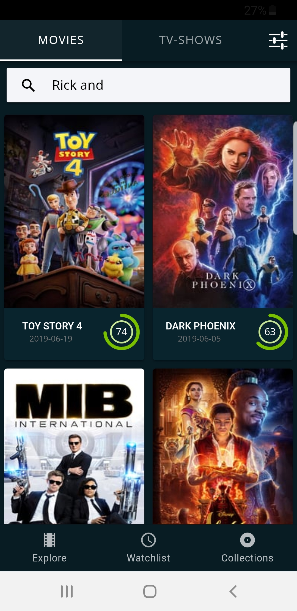
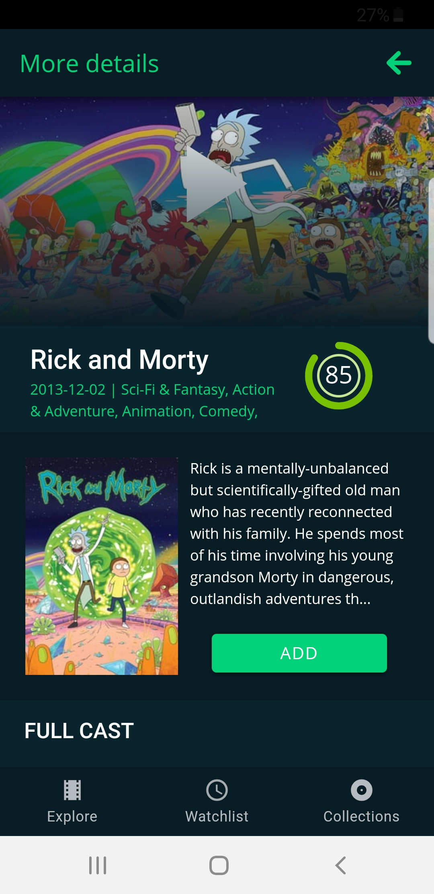
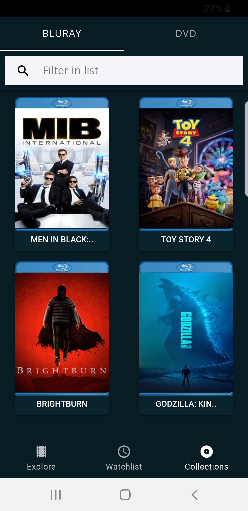
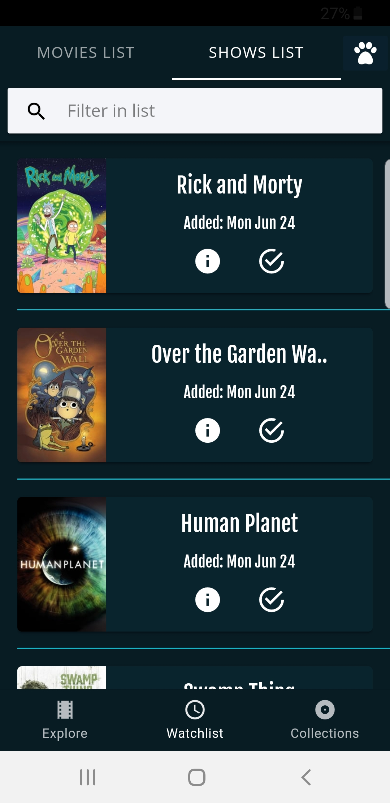

[](https://travis-ci.org/SinghParwinder/ionic-tmdb-app)

##  Ionic TMDB app

<p float="left">
  
   
  
  
</p>

### About this repo
This repo contains a simple application built with Ionic 4 framework using Angular 7. It's a simple app for android and ios for managing watchlists and collections of movies and tv shows.

- [Play Store Link](https://play.google.com/store/apps/details?id=tv.film.shows.manager.CoveredEe)

### Installation
```
npm install
```

### Browse
```
ionic serve
```
Note: this application is optimized for mobile devices only, so use developer tools->mobile device when testing this application on your browser. When you have your API key, just add it on the file src/app/common/providers/base.service.ts 

### Build 
```
ionic cordova build android --prod --release
```
```
ionic cordova ios android --prod --release
```
### Demo
https://play.google.com/store/apps/details?id=tv.film.shows.manager.CoveredEe

### TMDB API
This application use the TMDB public API. You can get a free API key just by registering on their platform. 

https://www.themoviedb.org/?language=en-US

### LICENSE 
This project is licensed under the MIT License - see the LICENSE.md file for details
